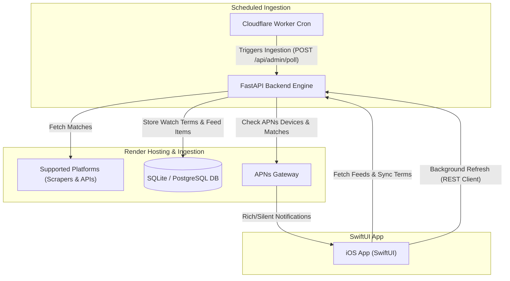

# 🦦 OshiReader (Otterpia)

[](https://fastapi.tiangolo.com)
[](#native-ios-app)

OshiReader is a native SwiftUI client application for iOS/iPadOS 17+, paired with a robust FastAPI ingestion backend. Designed for content tracking and idol/creator updates, OshiReader monitors your favorite creators, idols, and topics ("Oshi") across various platforms. It automatically aggregates search results, evaluates relevance, sends rich Apple Push Notifications (APNs), and synchronizes watch terms securely.

---

## 📐 System Architecture

Below is the high-level architecture showing how the backend ingestion, database storage, APNs notifications, and the SwiftUI client application interact:



---

## ✨ Features

- **Multi-Source Aggregation**: Fetches and unifies data from a wide variety of Japanese entertainment and media platforms.
- **Rich & Silent APNs Notifications**: Integrates with Apple Push Notification service to provide instant alerts with rich media previews and background refresh triggers.
- **Smart Relevance Filters**: Implements primary-text relevance scoring to filter out spam or unrelated articles before they reach the user's feed.
- **Offline Reading & Caching**: Supports caching of article content and images for access when offline.
- **Watch Term Synchronization**: Seamlessly syncs watch terms and aliases with a backend server using secure, device-specific credentials (`X-Device-Token` & `X-Device-Secret`).
- **Development Tooling**: Includes a dedicated "smoke checker" utility command to test connector outputs and verify match relevance rules against live sites.

---

## 🔌 Supported Sources

OshiReader utilizes custom scraping and API connectors to aggregate content from the following platforms:

| Service / Source | Type / Method | Details & Fallback |
| :--- | :--- | :--- |
| **YouTube** | Data API / Scraper | Uses YouTube Data API with search scraping fallback |
| **NicoNico** | Snapshot Search API | Queries NicoNico's snapshot search service |
| **TVer** | Keyword Search API | Fetches program/episode data via TVer API |
| **Note** | RSS Feed | Reads public tags and creator feeds |
| **5channel** | Web Scraper | Scrapes thread indexes for keyword activity |
| **Girls Channel** | Web Scraper | Scrapes community forum topics |
| **Togetter** | Web Scraper | Monitors curation pages and compiling logs |
| **ModelPress** | Search Scraper | Tracks entertainment articles |
| **Oricon** | RSS & Search | Parses Oricon article feeds and search results |
| **Yahoo News** | Web Scraper | Uses mirror sites to ensure EEA-safe access |
| **News/RSS** | RSS Feed | Aggregates curated Japanese entertainment feeds |
| **Google News Fallbacks** | Search Scraper | Used for *SmartNews, Ameblo, AERA, Hochi, Sponichi, Livedoor, Mantan Web, BARKS, Real Sound, CinemaCafe* |
| **Twitter (X)** | API v2 / Optional | Integrated when developer keys are configured |

*Watch terms also support aliases. The scheduler searches both the primary keyword and each alias, saving matches against the original watch term.*

---

## 🛠️ Backend Setup & Configuration

The backend is built with **FastAPI** and uses **SQLAlchemy** to interface with SQLite (local development) or PostgreSQL (production deployment).

### Local Quickstart

1. Navigate to the backend directory and set up a virtual environment:
   ```bash
   cd backend
   python3 -m venv .venv
   source .venv/bin/activate
   pip install -r requirements.txt
   ```
2. Set up your environment variables:
   ```bash
   cp .env.example .env
   ```
3. Run the FastAPI development server:
   ```bash
   uvicorn app.main:app --reload
   ```
   The local API is accessible at `http://127.0.0.1:8000`. You can test endpoints via the interactive Swagger docs at `http://127.0.0.1:8000/docs`.

### Environment Variables Reference

Configure these in your backend `.env` file:

| Environment Variable | Default | Description |
| :--- | :--- | :--- |
| `DATABASE_URL` | `sqlite:///./otterpia.db` | SQLAlchemy connection URL (e.g. `postgresql://...` for production) |
| `POLL_INTERVAL_MINUTES` | `15` | Default check-in frequency for automated workflows |
| `CONNECTOR_FETCH_TIMEOUT_SECONDS` | `25.0` | Timeout per connector platform |
| `ADMIN_API_TOKEN` | *None* | Authentication token for admin/write routes |
| `ALLOW_UNAUTHENTICATED_ADMIN` | `false` | Enable only in local development to bypass auth check |
| `CORS_ALLOW_ORIGINS` | *None* | Comma-separated browser origins allowed by CORS (Native iOS calls bypass CORS) |
| `YOUTUBE_API_KEY` | *None* | Optional API key for YouTube Data API (scrapes as a fallback) |
| `TWITTER_BEARER_TOKEN` | *None* | Optional Bearer Token for Twitter/X API search |
| `APNS_TEAM_ID` | *None* | Apple Developer Team ID |
| `APNS_KEY_ID` | *None* | APNs Key ID (`.p8` private key identifier) |
| `APNS_PRIVATE_KEY` | *None* | APNs `.p8` raw private key contents |
| `APNS_PRIVATE_KEY_PATH` | *None* | Alternative path to the APNs `.p8` private key file |
| `APNS_TOPIC` | `com.otterpia.oshireader.plus` | App Bundle ID for Push Notifications |
| `APNS_USE_SANDBOX` | `false` | APNs host override when a stored token has no explicit environment |
| `BACKEND_PUBLIC_URL` | `https://oshireader.onrender.com` | Base public URL of your backend (for notification redirects) |

---

## 📱 Native iOS App

The client app is a native Swift project written in **SwiftUI** (targeting **iOS 17.0+**). It uses `xcodegen` to generate project files dynamically.

### Setup & Installation

1. Make sure you have Xcode 15+ and `xcodegen` installed (e.g., `brew install xcodegen`).
2. Navigate to the iOS directory:
   ```bash
   cd ios-swift
   xcodegen generate
   open OshiReader.xcodeproj
   ```
3. Select the target device or simulator and run the application.

### Build Configurations & Schemes

The project uses target schemas to run against different environments:

| Xcode Scheme | Build Configuration | Target Backend URL |
| :--- | :--- | :--- |
| **OshiReader Local** | `Debug` | `http://127.0.0.1:8000` |
| **OshiReader Staging** | `Staging` | Configured staging URL |
| **OshiReader Production** | `Release` | `https://oshireader.onrender.com` |

---

## ⚙️ Ingestion & Deployment Automation

### Automated Ingestion
OshiReader uses a Cloudflare Worker Cron in `cloudflare-worker/` to call
`POST /api/admin/poll` every 15 minutes. Cloudflare stores `ADMIN_API_TOKEN` as
an encrypted Worker secret. GitHub's manual poll workflow remains available for
diagnostics and emergency triggering.

Deploy the Worker after authenticating Wrangler:

```bash
cd cloudflare-worker
npx wrangler login
npx wrangler secret put ADMIN_API_TOKEN
npx wrangler deploy
```

The deployed Worker's `/health` endpoint is public. Its manual `POST /run`
endpoint requires the same bearer token as the backend.

### Manual Render Deployments
A manual Render deployment workflow is available in [.github/workflows/deploy-render.yml](file:///.github/workflows/deploy-render.yml). This triggers the Render deploy hook automatically on workflow dispatch.

---

## 🧪 Testing & Diagnostics

### Smoke-Checking Data Sources
To diagnose connector issues or verify why a particular site is dropping or matching articles, use the local Python smoke tester script:
```bash
python3 backend/scripts/smoke_sources.py --keyword '吉沢亮' --platform livedoor --platform realsound --samples 2
```
This prints matching items along with their match evaluation status (`KEEP`, `DROP` for relevance failures, or `ERROR` for connection issues).

### Running Live Integration Tests
To test live data endpoints or notification configurations within the iOS application, run:
```bash
OSHI_READER_RUN_LIVE_UI_TESTS=1 xcodebuild test \
  -project ios-swift/OshiReader.xcodeproj \
  -scheme "OshiReader Local" \
  -destination 'platform=iOS Simulator,name=iPhone 17' \
  -only-testing:OshiReaderUITests
```

### Diagnostics API
The FastAPI backend serves diagnostics and stats at `/api/admin/stats`. This helps developers verify APNs device registration counts, recent logging events, active watch terms, and token configurations.

---

## 📄 License & Privacy

- **Privacy**: The app stores no personal identifying information. See [PRIVACY.md](file:///PRIVACY.md) for details on device data usage.
- **Ownership**: Proprietary development for Otterpia.
